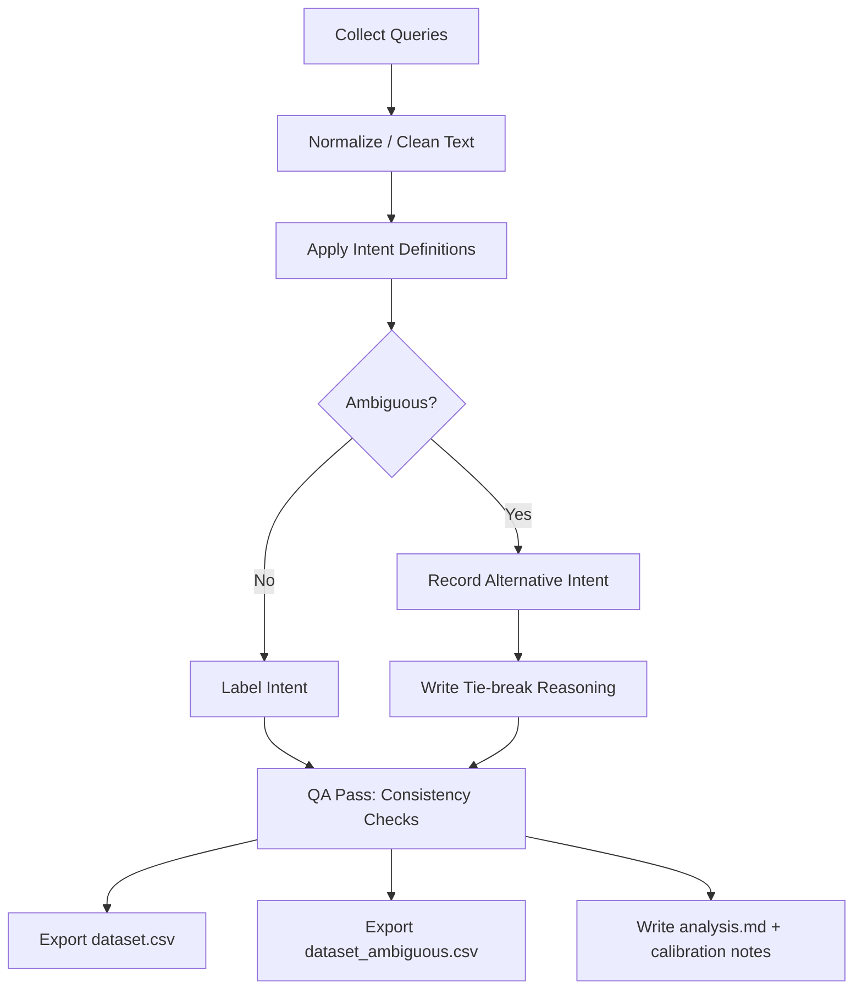

# Search Intent Classification Dataset

A small, human-labeled dataset of search queries categorized by intent.

## Why this exists
Search and AI rating work often involves understanding what a user is trying to accomplish.  
This project demonstrates my ability to:
- classify search intent consistently
- define clear labeling rules
- create a clean dataset suitable for QA or model training

Includes an "ambiguous query" dataset demonstrating tie-break reasoning for realistic search evaluation scenarios.

## How to Review This Repository

This project demonstrates how search queries can be labeled by intent using clear guidelines and reasoning.

If you're reviewing this repository, here is the quickest way to understand it:

1. **Start with `intent-definitions.md`**
   - Defines the rules used to classify queries.
   - Shows the taxonomy used for labeling.

2. **Open `dataset.csv`**
   - Contains labeled examples of common search queries.
   - Each entry includes a query, assigned intent, and justification notes.

3. **Review `dataset_ambiguous.csv`**
   - Shows difficult queries that could fit multiple intents.
   - Includes alternative interpretations and tie-break reasoning.

4. **Read `rater-calibration.md`**
   - Demonstrates how raters align labeling decisions to maintain consistency.

5. **See `analysis.md`**
   - Provides dataset summary, QA checks, and labeling consistency notes.

Together these files simulate a simplified **search evaluation workflow used in AI training and search quality rating.**

## Intents used
- Informational
- Navigational
- Transactional
- Local

See: `intent-definitions.md`

## Dataset
The dataset is in `dataset.csv` with columns:
- query
- intent
- notes

## Dataset Creation Pipeline (Visual)

md
This pipeline mirrors real-world search evaluation workflows: guidelines → labeling → ambiguity resolution → QA → calibration.

## QA
Basic checks and summaries are in `analysis.md`.

## How this can be used
- training/evaluating intent classifiers
- improving search relevance
- rater calibration examples
