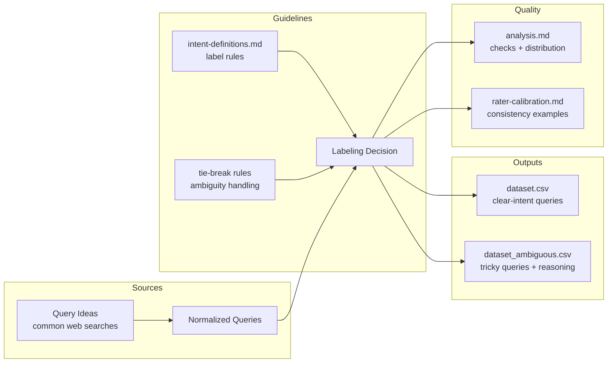

```md
# Labeling Pipeline Diagram


```mermaid
flowchart LR
  subgraph Sources
    Q[Query Ideas<br/>common web searches] --> N[Normalized Queries]
  end

  subgraph Guidelines
    D[intent-definitions.md<br/>label rules] --> L[Labeling Decision]
    T[tie-break rules<br/>ambiguity handling] --> L
  end

  N --> L

  subgraph Outputs
    L --> C[dataset.csv<br/>clear-intent queries]
    L --> A[dataset_ambiguous.csv<br/>tricky queries + reasoning]
  end

  subgraph Quality
    L --> QA[analysis.md<br/>checks + distribution]
    L --> CAL[rater-calibration.md<br/>consistency examples]
  end

```
md
This pipeline mirrors real-world search evaluation workflows: guidelines → labeling → ambiguity resolution → QA → calibration.
